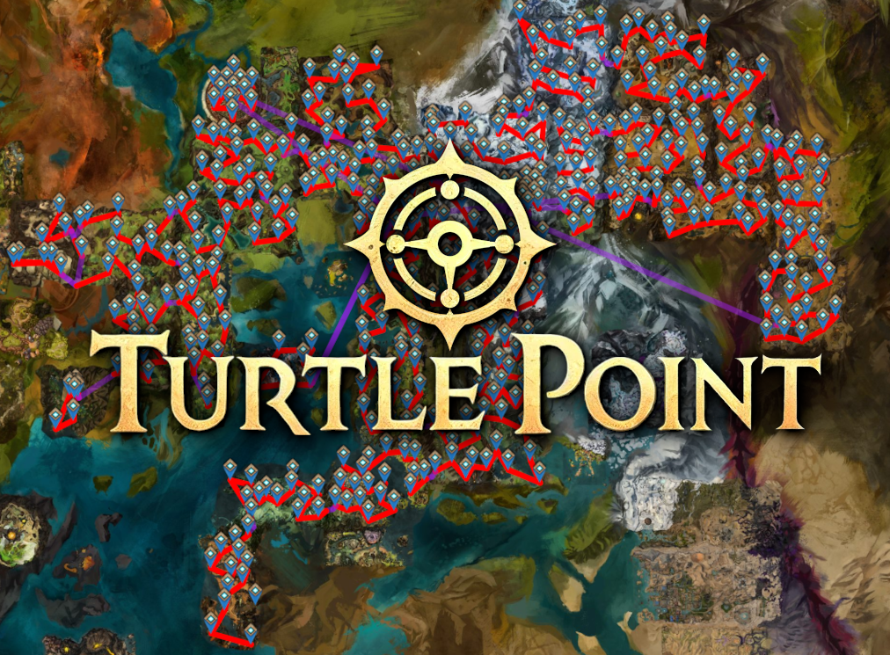

Turtle Point is a tool that creates the most optimal path to unlock all of the
central tyria waypoints on a Siege Turtle or any other multi seat chair / mount.

Each individual map has the optimal path through the map calculated.
Additionally a path from the end of one map to the start of the next is taken
into account when calculating the path.

Possible Advancement
================================================================================

Map Route Selection
--------------------------------------------------------------------------------
While the path within each map is dynamically calculated, and which portals
should be used to traverse between maps are dynamically calculated. However the
path for which maps should be visited in what order are not dynamically
calculated. This could be added in order to ensure that the overall route is
optimal. This could be a computationally expensive algorithm if done
incorrectly. All characters start with the 5 waypoints outside each starting
city so any of them can be the starting point, the ending point can be anywhere.

Waypoint Backtracking
--------------------------------------------------------------------------------
Characters have every waypoint they have already visited unlocked and can in
theory teleport back to them without issue. It is possible that there is an
optimzation for this to avoid additional walking distances.

Because all characters have the 5 starting waypoints unlocked this can also be
used to optimize travel to those locations.

Bad Waypoint Denotation
--------------------------------------------------------------------------------
Some waypoints are within jumping puzzle dismount areas. These are annoying.
Future versions may skip these, or may account for them by indicating to the
player that they will be dismounted when they teleport there.

Other waypoints have the potential to be contested. These waypoints may not be
visited while they are contested. I don't really know what to do about these
except skip them, but there may be a mechanism discovered in the future to
handle these better.

Better Walk Routes
--------------------------------------------------------------------------------
All of the paths between points are straight lines. They could be terrain
conforming paths with specific weights.

Warning / Alternate Path Around Waypoints that dismount
--------------------------------------------------------------------------------
* Cuatl Waypoint (big area) 1202
* Spiral Waypoint (small area) 309
* Arca Waypoint (small area) 178
* Sorrow's Embrace Waypoint (small area) 1343
* Talus Waypoint (small area) 580
* False Lake Waypoint (big area) 232

BUG: Silverwastes map not rendering properly
--------------------------------------------------------------------------------
Silverwastes seems to be not rendering properly for an unknown reason. Maybe an
issue maybe not depending on how widespread it is.

Filepaths
================================================================================
* TurtleRoute/ - A CPP Traveling Salesman Problem solver given a fixed start and end point
* shortpath_cache/ - A cache of all the outputs from `TurtleRoute/`'s executable
* api_cache/ - A cache of GW2 API responses
* wiki_cache/ - A cache of wiki.guildwars2.com pages
* main.py - the main process that can be run to generate the marker pack. Other python code is called from this module.
